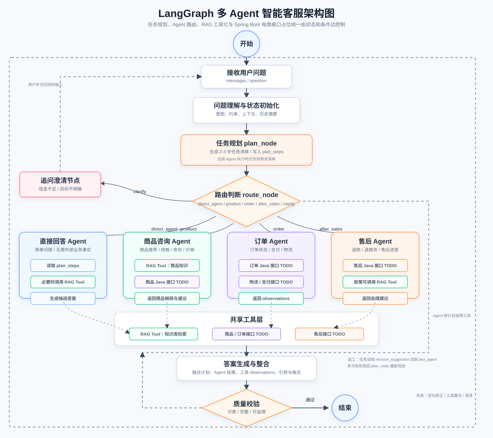

# ShopMind 智能电商交易与多 Agent 客服平台

一个面向电商客服场景的多 Agent 问答系统。后端基于 FastAPI + LangGraph 编排，接入 RAG、商品/订单/售后工具、PostgreSQL 会话记忆和 SSE 流式输出；前端使用原生 HTML/CSS/JS 实现多会话聊天界面，方便面试官直接拉取查看。



## 项目亮点

- 多阶段工作流：问题规划、任务分发、专职 Agent 执行、答案汇总、质量评估与回修
- 多业务域覆盖：商品咨询、订单查询、物流追踪、售后状态与政策查询
- 检索增强：Milvus 向量检索接入知识库，支持基于上下文的回答生成
- 会话管理：PostgreSQL 持久化会话列表与 LangGraph checkpoint
- 流式体验：`/api/chat/stream` 基于 SSE 输出节点和 token 事件
- 面试友好：仓库结构清晰，README 可直接作为项目说明文档使用

## 技术栈

`FastAPI` `LangGraph` `LangChain` `PostgreSQL` `Milvus` `DashScope` `Java API` `HTML/CSS/JS`

## 目录结构

```text
.
├── backend/
│   ├── app/
│   ├── Dockerfile
│   ├── requirements.txt
│   └── run.py
├── deploy/
│   └── nginx.conf
├── docs/
│   ├── ARCHITECTURE.md
│   └── DOCKER_DEPLOYMENT.md
├── frontend/
│   ├── Dockerfile
│   ├── index.html
│   ├── script.js
│   └── style.css
├── docker-compose.yml
├── .env.example
└── README.md
```

## 快速启动

推荐使用 Docker Compose 一键启动完整演示环境。

1. 复制环境变量模板并填写模型 Key

PowerShell:

```powershell
Copy-Item .env.example .env
```

2. 一键启动

```bash
docker compose up -d --build
```

3. 访问服务

- 前端页面：`http://127.0.0.1:5500`
- 后端接口：`http://127.0.0.1:8000`
- 接口文档：`http://127.0.0.1:8000/docs`

## 本地开发启动

如果不使用 Docker，也可以只启动依赖服务，再本地运行前后端。

```bash
docker compose up -d postgres milvus
```

后端：

```bash
cd backend
pip install -r requirements.txt
python run.py
```

前端：

```bash
cd frontend
python -m http.server 5500
```

## API

- `GET /`
- `GET /health`
- `POST /api/chat`
- `POST /api/chat/stream`
- `GET /api/threads`
- `GET /api/threads/{thread_id}`
- `DELETE /api/threads/{thread_id}`

## 环境变量

| 变量 | 说明 |
| --- | --- |
| `LLM_MODEL` | 大模型名称 |
| `LLM_API_KEY` | 大模型 API Key |
| `LLM_BASE_URL` | 大模型服务地址 |
| `DASHSCOPE_API_KEY` | Embedding 服务 Key |
| `EMBED_MODEL_NAME` | 向量化模型名称 |
| `MILVUS_URL` | Milvus 地址 |
| `DB_NAME` | Milvus 数据库名 |
| `COL_NAME` | Milvus 集合名 |
| `JAVA_API_BASE_URL` | 业务 Java 服务地址 |
| `JAVA_API_TIMEOUT` | Java 服务超时 |
| `JAVA_API_TOKEN` | Java 服务鉴权 Token |
| `POSTGRES_URI` | PostgreSQL 连接串 |


## 说明

- `frontend/index.html` 可直接打开，或通过静态服务访问
- Docker Compose 已内置 PostgreSQL、Milvus、etcd、MinIO、后端和前端
- Java 业务服务源码不在当前仓库，默认通过 `host.docker.internal:8080` 访问宿主机服务
- 售后“创建工单”接口目前返回结构化占位信息，便于展示完整链路

更多架构说明见 [docs/ARCHITECTURE.md](docs/ARCHITECTURE.md)。
Docker 部署说明见 [docs/DOCKER_DEPLOYMENT.md](docs/DOCKER_DEPLOYMENT.md)。
